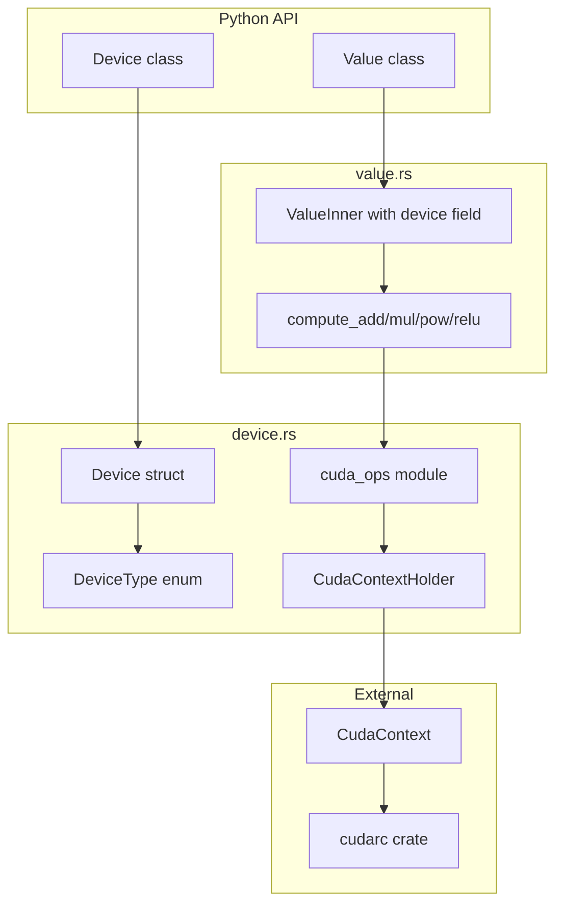

# CUDA Support Implementation with cudarc

## Overview

The micrograd_rs project implements CUDA support using the `cudarc` crate (v0.18), providing a unified device abstraction for CPU and GPU execution. Currently, this is a **scaffolding implementation** that validates CUDA availability but performs scalar operations on CPU for performance reasons (GPU overhead exceeds benefit for single values).

## Architecture




## Current Implementation Details

### 1. Feature Flag Configuration

[`Cargo.toml`](Cargo.toml):

```toml
[features]
default = []
cuda = ["cudarc"]

[dependencies]
cudarc = { version = "0.18", optional = true, features = ["cuda-version-from-build-system"] }
```

The CUDA code is conditionally compiled with `#[cfg(feature = "cuda")]`.

### 2. Device Abstraction ([`src/device.rs`](src/device.rs))

**DeviceType Enum:**

- `DeviceType::Cpu` - Default CPU execution
- `DeviceType::Cuda` - NVIDIA GPU execution (only when `cuda` feature enabled)

**Device PyClass:**

- `Device::cpu()` - Create CPU device
- `Device::cuda()` - Create CUDA device (checks availability, returns PyResult)
- `Device::is_cuda_available()` - Static method to check CUDA support
- Helper methods: `is_cpu()`, `is_cuda()`, `__repr__`, `__str__`

**CUDA Availability Check:**

```rust
pub fn is_cuda_available() -> bool {
    use cudarc::driver::CudaContext;
    CudaContext::new(0).is_ok()
}
```


### 3. CUDA Operations Module ([`src/device.rs:118-195`](src/device.rs))

**CudaContextHolder:**

- Wraps `Arc<CudaContext>` for GPU operations
- Thread-local storage via `CUDA_CTX` for efficiency
- Methods: `add()`, `mul()`, `pow()`, `relu()`

**Current Behavior:** All operations return CPU-computed results:

```rust
pub fn add(&self, a: f64, b: f64) -> Result<f64, DriverError> {
    Ok(a + b)  // CPU computation, CUDA context validates GPU access
}
```

**Context Access Pattern:**

```rust
pub fn with_cuda_context<F, R>(f: F) -> Result<R, DriverError>
where F: FnOnce(&CudaContextHolder) -> Result<R, DriverError>
```


### 4. Value Integration ([`src/value.rs`](src/value.rs))

**Device-Aware ValueInner:**

```rust
pub struct ValueInner {
    pub data: f64,
    pub grad: f64,
    pub op: Op,
    pub device: DeviceType,  // Added for device tracking
}
```

**Device-Dispatching Compute Functions:**

```rust
fn compute_add(a: f64, b: f64, device: DeviceType) -> f64 {
    match device {
        DeviceType::Cpu => a + b,
        #[cfg(feature = "cuda")]
        DeviceType::Cuda => {
            cuda_ops::with_cuda_context(|ctx| ctx.add(a, b))
                .unwrap_or(a + b)  // Fallback on error
        }
    }
}
```

**Device Transfer Methods:**

- `value.to(device)` - Move to specific device
- `value.cpu()` - Move to CPU
- `value.cuda()` - Move to CUDA (with availability check)

### 5. Build Instructions

```bash
# Standard build (CPU only)
poetry run maturin develop

# With CUDA support
poetry run maturin develop --features cuda
```

**CUDA Requirements:**

- NVIDIA GPU with CUDA capability
- CUDA Toolkit (11.x or 12.x)
- `nvcc` in PATH

## Files Summary

| File | Purpose ||------|---------|| [`Cargo.toml`](Cargo.toml) | Feature flag and cudarc dependency || [`src/device.rs`](src/device.rs) | Device abstraction and CUDA context || [`src/value.rs`](src/value.rs) | Device-aware Value with compute dispatch || [`tests/test_device.py`](tests/test_device.py) | Device API tests || [`benchmarks/benchmark_device.py`](benchmarks/benchmark_device.py) | CPU vs CUDA benchmarks |

## Current Limitations

1. **Scalar Operations Only:** GPU kernels not beneficial for single values
2. **No Tensor Support:** True GPU acceleration requires batched operations