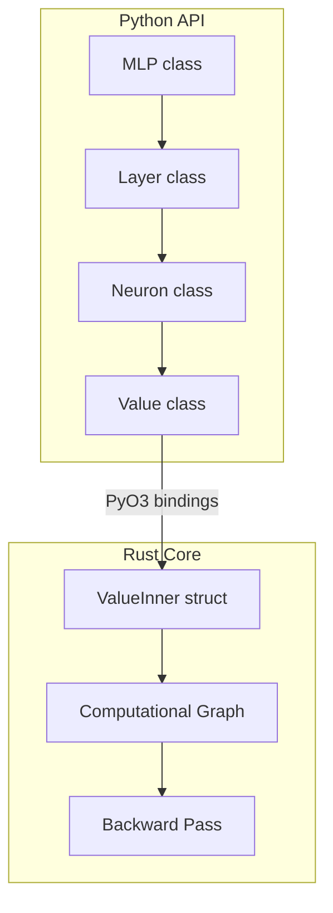

# Rust Micrograd Implementation with PyO3 Bindings

## Overview

Reimplement the micrograd autograd engine in Rust with PyO3 bindings. The implementation will provide the same Python API as the original library while leveraging Rust's performance and safety.

## Architecture




## Key Implementation Details

### 1. Value Class (Core Autograd Engine)

The `Value` class requires shared ownership for the computational graph since multiple nodes can reference the same parent. In Rust, this will use `Rc<RefCell<ValueInner>>` (or `Arc<RwLock>` for thread safety).**Target API:**

```python
from micrograd_rs import Value
a = Value(-4.0)
b = Value(2.0)
c = a + b
d = a * b + b**3
c += c + 1
d += 3 * d + (b - a).relu()
g.backward()
print(a.grad, b.grad)
```

**Operations to implement:**

- Arithmetic: `__add__`, `__mul__`, `__pow__`, `__neg__`, `__sub__`, `__truediv__`
- Reverse ops: `__radd__`, `__rmul__`, `__rsub__`, `__rtruediv__`
- Activation: `relu()`
- Autograd: `backward()`
- Properties: `data`, `grad`

### 2. Neural Network Module

Build on top of `Value` to create:

- `Neuron(nin, nonlin=True)` - single neuron
- `Layer(nin, nout, **kwargs)` - layer of neurons
- `MLP(nin, nouts)` - multi-layer perceptron

All inherit from `Module` base with `zero_grad()` and `parameters()`.

## Project Structure

```javascript
micrograd_rs/
├── Cargo.toml
├── pyproject.toml
├── src/
│   ├── lib.rs          # PyO3 module definition
│   ├── value.rs        # Value struct and autograd
│   └── nn.rs           # Neuron, Layer, MLP
└── python/
    └── micrograd_rs/
        └── __init__.py # Re-exports
```


## Implementation Steps

### Phase 1: Project Setup

- Initialize Cargo project with PyO3 and maturin
- Configure `Cargo.toml` with dependencies: `pyo3`, `rand`
- Create `pyproject.toml` for Python packaging

### Phase 2: Value Implementation

- Create `ValueInner` struct with `data`, `grad`, `_prev`, `_op`, and backward closure
- Use `Rc<RefCell<ValueInner>>` for shared ownership in computational graph
- Implement all arithmetic operations with gradient computation
- Implement topological sort for `backward()`

### Phase 3: Python Bindings for Value