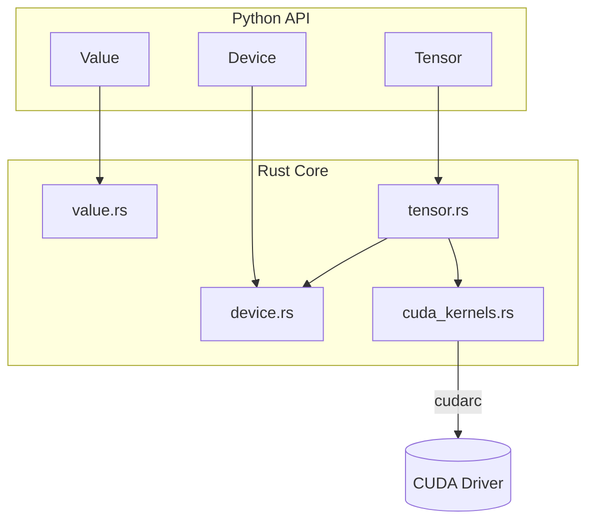

# Tensor Autograd + CUDA Batching (cudarc)

## Goal

Add a new `Tensor` type that supports **batched operations** on CPU and CUDA, with **autograd/backward** for core ops, so GPU resources are used effectively (unlike scalar ops).

- Keep existing scalar `Value` (f64) API unchanged.
- Add new Python class `Tensor` (recommended separation).
- Focus on 1D tensors first (vector) to keep scope tight and get real GPU speedups.

## Target Python API

- Construction:
- `Tensor([1.0, 2.0, 3.0], device=Device.cpu()/Device.cuda())`
- Ops:
- `+`, `*`, `**(scalar)`, `.relu()`, `.sum()`
- Autograd:
- `.backward()` populates `.grad` (a `Tensor`)
- Device:
- `.device`, `.to(device)`, `.cpu()`, `.cuda()`
- Interop:
- `.tolist()` (debug/testing)

## Rust Architecture

### Data model

- `TensorInner` stored as `Rc<RefCell<TensorInner>>` (like `Value`, `#[pyclass(unsendable)]`).
- `TensorInner` fields:
- `data: TensorStorage`
- `grad: Option<TensorStorage>` (allocated lazily)
- `op: TensorOp` (edges to parents)
- `device: DeviceType`
- `len: usize`

`TensorStorage`:

- CPU: `Vec<f32>`
- CUDA: `cudarc::driver::CudaSlice<f32>`

### Autograd ops (MVP)

`TensorOp` variants:

- `None`
- `Add(a, b)`
- `Mul(a, b)`
- `Pow(base, exp_scalar)`
- `ReLU(x)`
- `Sum(x)` (reduces vector -> scalar tensor of len=1)

Backward rules (elementwise):

- Add: `da += dout`, `db += dout`
- Mul: `da += b * dout`, `db += a * dout`
- Pow: `da += (exp * a^(exp-1)) * dout`
- ReLU: `dx += dout * (x>0)`
- Sum: `dx += broadcast(dout)`

## CUDA implementation (cudarc)

### Context/device handling

Reuse existing `Device`/`DeviceType`, but upgrade CUDA internals from “context only” to an alloc+launch capable handle:

- Maintain a thread-local `CudaDevice` (or equivalent from cudarc driver API) and a cached loaded kernel module.

### Kernels

Add `src/cuda_kernels.rs` (or `src/device/cuda_kernels.rs`) that:

- Compiles or embeds PTX for kernels:
- `ew_add_f32`, `ew_mul_f32`, `ew_relu_f32`, `ew_pow_f32_scalar`
- `ew_mul_inplace` / `ew_add_inplace` helpers for backward accumulation
- `reduce_sum_f32` (two-stage reduction if needed)

Notes:

- Prefer **pre-embedded PTX** for reproducibility; optionally support NVRTC compile behind a feature flag if desired.
- Use grid-stride loops for elementwise kernels.

### CPU fallback

Implement identical ops using Rust loops over `Vec<f32>`.

## File-level changes

- Add new module:
- [`/home/cyyeh/repos/rust-py-bindings/micrograd_rs/src/tensor.rs`](./src/tensor.rs)
- [`/home/cyyeh/repos/rust-py-bindings/micrograd_rs/src/cuda_kernels.rs`](./src/cuda_kernels.rs)
- Update module exports:
- [`/home/cyyeh/repos/rust-py-bindings/micrograd_rs/src/lib.rs`](./src/lib.rs) to `mod tensor;` and `m.add_class::<tensor::Tensor>()?;`
- [`/home/cyyeh/repos/rust-py-bindings/micrograd_rs/python/micrograd_rs/__init__.py`](./python/micrograd_rs/__init__.py) to export `Tensor`
- Update device internals:
- [`/home/cyyeh/repos/rust-py-bindings/micrograd_rs/src/device.rs`](./src/device.rs) to provide `with_cuda_device_and_kernels(...)` helpers used by `tensor.rs`.
- Tests:
- Add [`/home/cyyeh/repos/rust-py-bindings/micrograd_rs/tests/test_tensor.py`](./tests/test_tensor.py)
- Benchmarks:
- Update or add [`/home/cyyeh/repos/rust-py-bindings/micrograd_rs/benchmarks/benchmark_tensor.py`](./benchmarks/benchmark_tensor.py) for large vector ops (e.g. 1e6 elements) CPU vs CUDA.
- Docs:
- Update [`/home/cyyeh/repos/rust-py-bindings/micrograd_rs/README.md`](./README.md) with `Tensor` examples and notes.

## Acceptance criteria

- **Correctness**:
- CPU `Tensor` ops match numpy for add/mul/pow/relu/sum.
- Autograd grads correct (numerical check for small vectors).
- **CUDA**:
- When built with `--features cuda` and CUDA available, `Tensor` runs kernels on GPU.
- Benchmark shows meaningful speedup for large vectors vs CPU.
- **Stability**:
- Existing scalar `Value` tests still pass unchanged.

## Implementation todos

- **tensor-core**: Implement `TensorInner`, storage enum (CPU/CUDA), basic constructors, device transfer, and `.tolist()`.
- **tensor-ops-fwd**: Implement forward ops `add/mul/pow/relu/sum` with CPU paths.
- **cuda-kernels**: Add cudarc kernel loading + PTX and CUDA forward paths for elementwise + reduction.
- **tensor-autograd**: Implement topo sort + backward for `TensorOp` using CPU/CUDA batched kernels and grad accumulation.